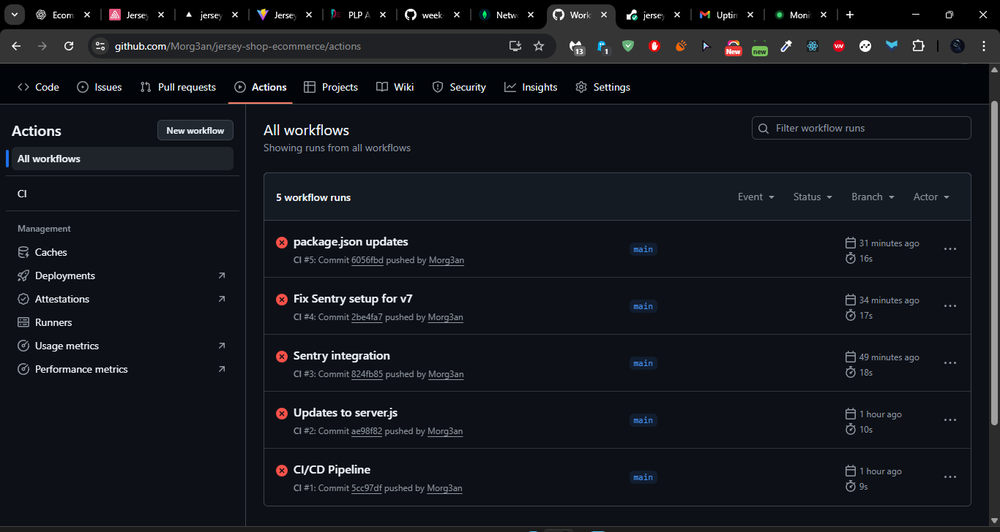
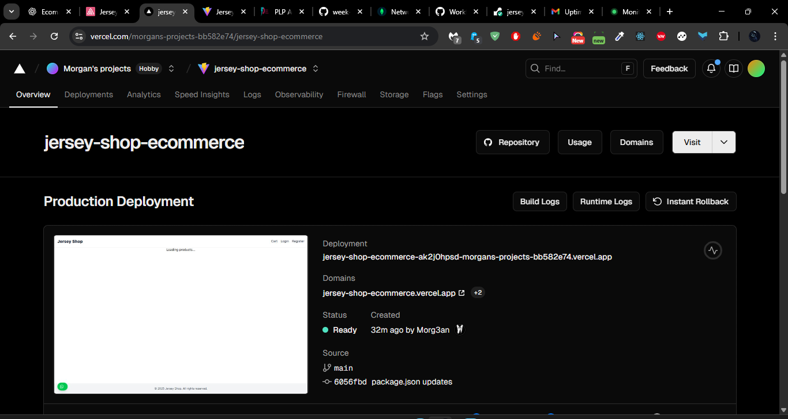
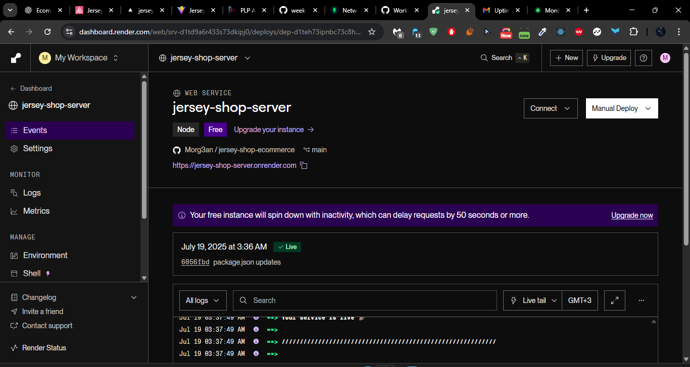

Jersey Shop – Deployment & DevOps


This is the final deployment and DevOps-ready version of the Jersey Shop MERN stack application.

🌐 Deployed URLs

Frontend: https://jersey-shop-ecommerce.vercel.app

Backend API: https://jersey-shop-server.onrender.com/api

🚀 What’s Included

✅ Full Deployment

Frontend deployed on Vercel

Backend deployed on Render with MongoDB Atlas as database

Environment variables configured securely on both platforms

🔄 CI/CD Setup

GitHub Actions for continuous integration and deployment

Frontend & backend auto-deploy on push to main branch

⚙️ Monitoring

/health route added to Express backend

UptimeRobot monitoring active

Sentry used for error tracking on backend

Render server logs enabled

📸 Screenshots

✅ CI/CD Pipeline in Action




✅ Frontend Deployment




✅ Backend Deployment




🧪 Features Implemented

🧑‍💻 User

Register/Login with email/password

Browse jerseys, customize, add to cart

Checkout and place orders

View past orders

🔧 Admin

Admin dashboard

CRUD for products and orders

Delete users

🛠 Tech Stack

Frontend

React (Vite)

React Router

Context API

Axios

TailwindCSS

Backend

Node.js

Express.js

MongoDB (Atlas) + Mongoose

JWT Auth

Helmet for security

Morgan for logging

Sentry for error tracking

📁 Project Structure

jersey-shop/
├── client/             # React frontend
│   ├── src/
│   │   ├── components/
│   │   ├── pages/
│   │   ├── hooks/
│   │   ├── context/
│   │   └── services/
├── server/             # Express backend
│   ├── models/
│   ├── routes/
│   ├── controllers/
│   ├── middleware/
│   └── utils/

⚙️ Setup Instructions

1. Clone the Repo

git clone https://github.com/Morg3an/jersey-shop-ecommerce.git
cd jersey-shop-ecommerce

2. Install Dependencies

npm install
cd client
npm install

3. Create .env Files

server/.env

PORT=5000
MONGO_URI=<your-mongodb-uri>
JWT_SECRET=<your-jwt-secret>
SENTRY_DSN=<optional-sentry-dsn>

client/.env

VITE_API_URL=https://jersey-shop-server.onrender.com/api

4. Run the App Locally

# In root folder
npm run dev
# In another terminal:
cd client && npm run dev

📦 Deployment Scripts

npm run build for frontend

npm start for backend

🛡 Maintenance Plan

Weekly npm update for dependencies

MongoDB Atlas scheduled backups

Manual redeploy from previous commits in case of failure (rollback strategy)

```